# About

This module covers -
1. Downloading the Chicago crimes data to the driver node local temp directory
2. Persisting the downloaded data to the "staging" information zone (blob storage container)
3. Reading-parsing the raw data and persisting it to Parquet in the "raw" information zone (blob storage container)
4. Creating an external table definition on the raw data
5. Exploring the raw dataset with Spark SQL
6. Curating the dataset - get rid of columns we dont want, augment with temporal attributes and such
7. Creating an external table on the curated dataset
8. Creating some basic visualizations - we will repeat this in Azure Data Explorer
 

Screenshots of code have been deliberately included for the benefit of those who just want to read the lab.

## Download the Chicago crimes dataset and upload to blob storage staging zone

### 1.  Navigate to the curation notebook and click on "run all"
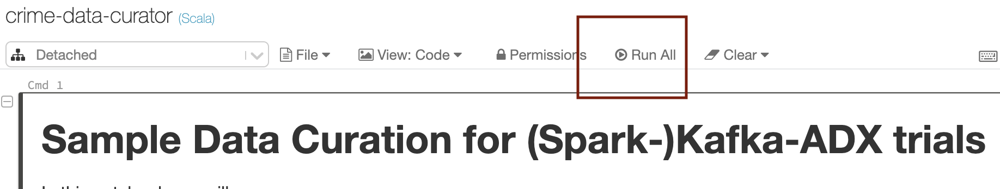
 

 

### 2.  The dataset will get downloaded to tghe driver node local linux file system/DBFS
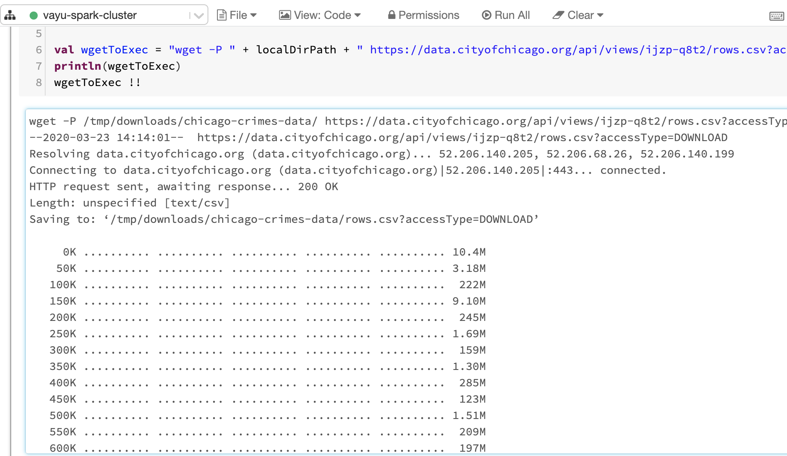
 

 

### 3.  Lets rename the file to meaningful
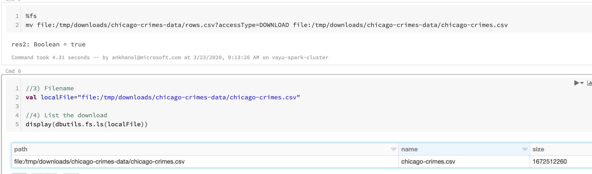
 

 

### 4.  Create a destination directory in the staging zone, and upload
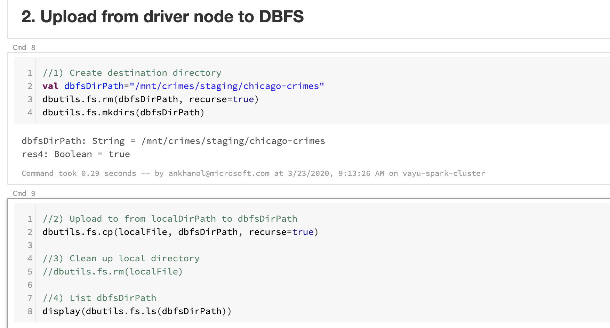
 

 

## Read raw CSV and persist to blob storage raw zone as parquet and explore the dataset with Spark SQL

### 5.  Read the data in the staging zone and persist as parquet to the raw zone
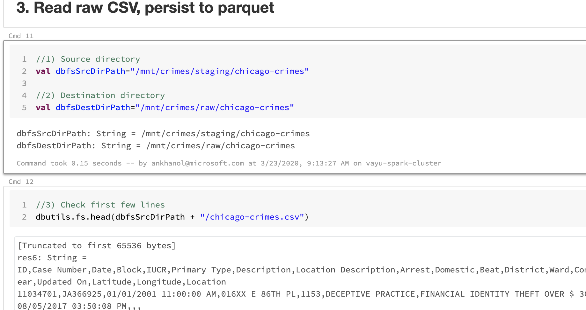
 

 

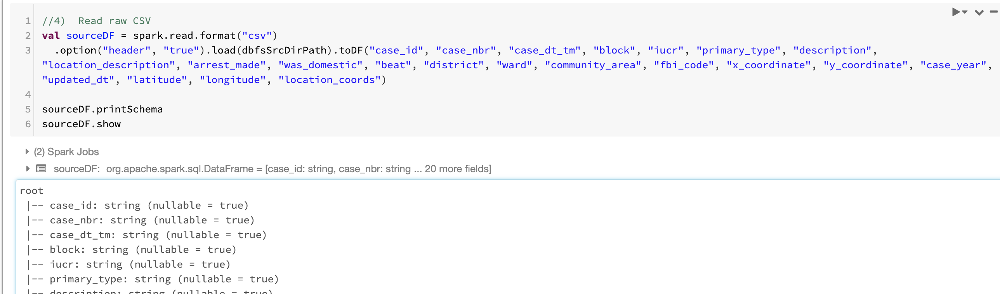
 

 

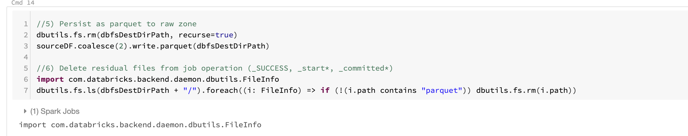
 

 

  
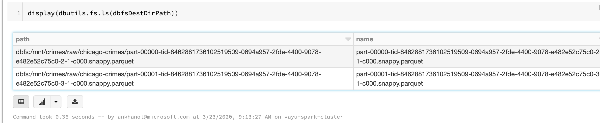
 

 

### 6.  Create an external table on the raw dataset ad explore the same with Spark SQL

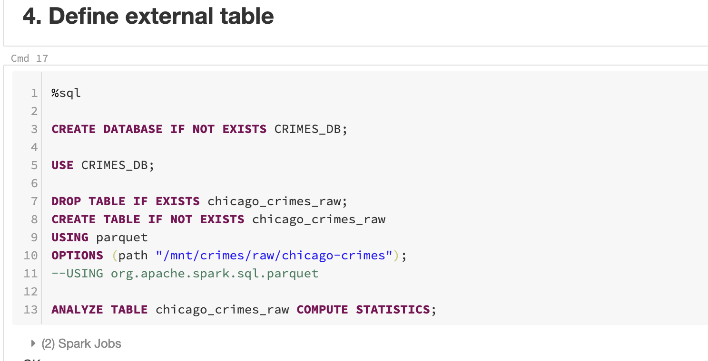
 

 

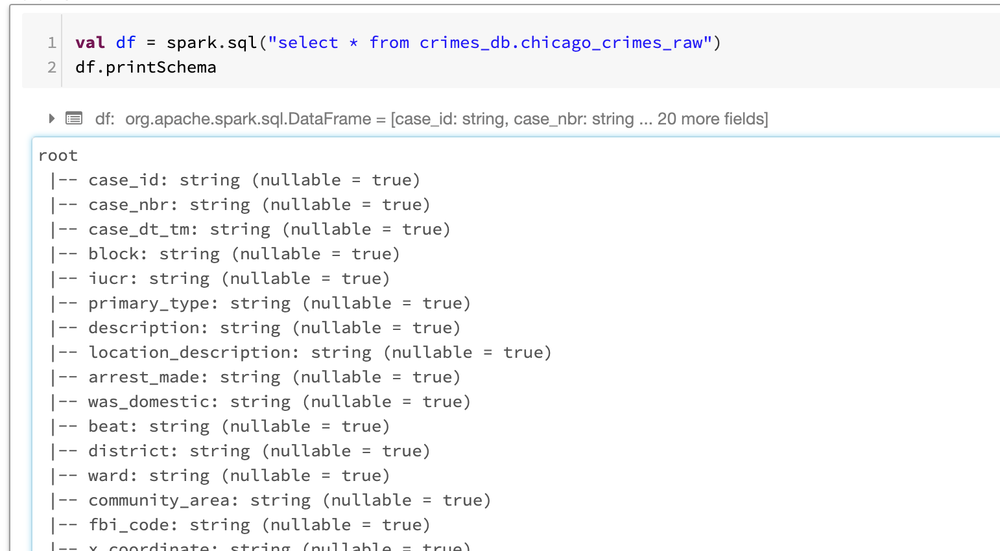
 

 

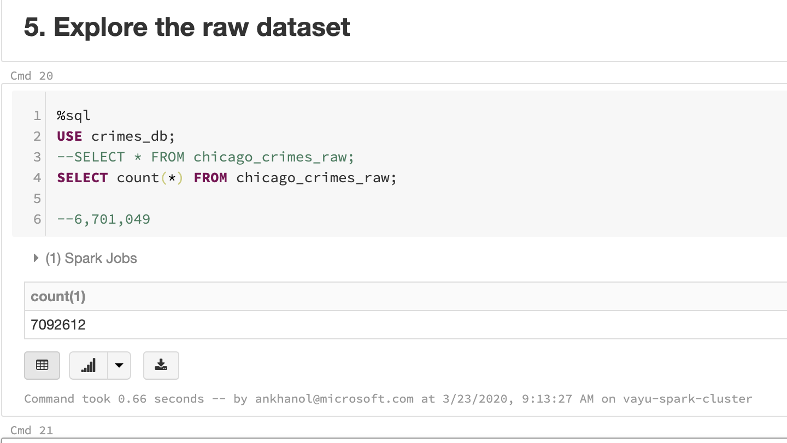
 

 

## Curate and persist to blob storage curatedd zone as parquet and explore the dataset with Spark SQL

### 7.  Curate the raw dataset and persist 

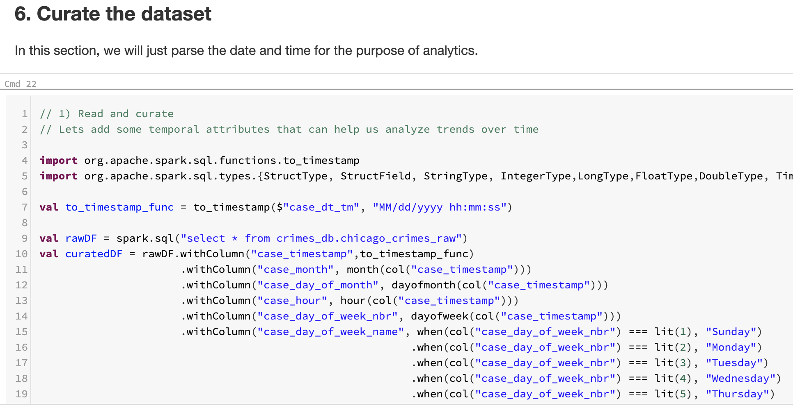
 

 

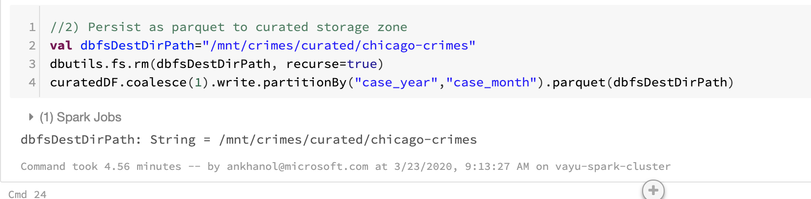
 

 

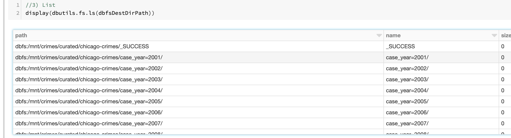
 

 

### 8.  Create an external table on the curated dataset, and explore it with Spark SQL

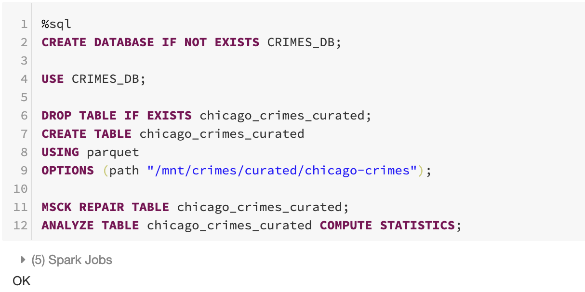
 

 

 
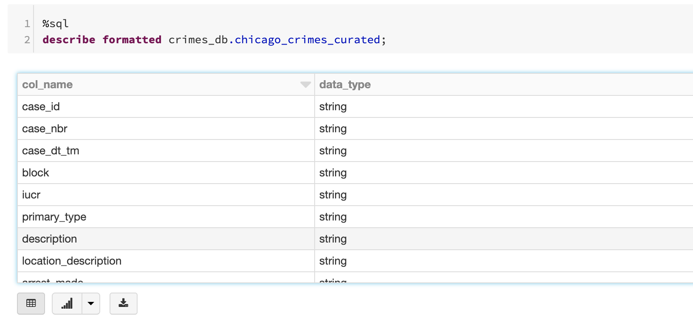
 

 

 
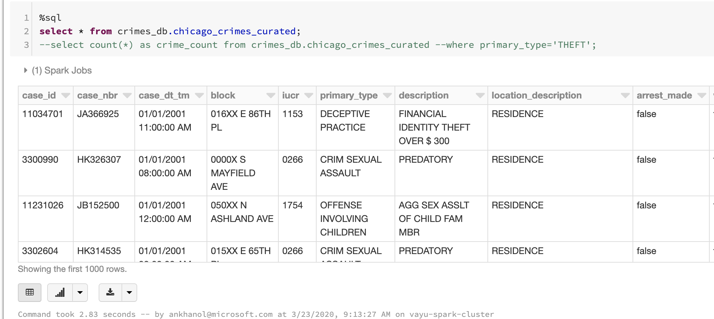
 

 

## Visualize the curated dataset

### 9.  Analyze and visualize
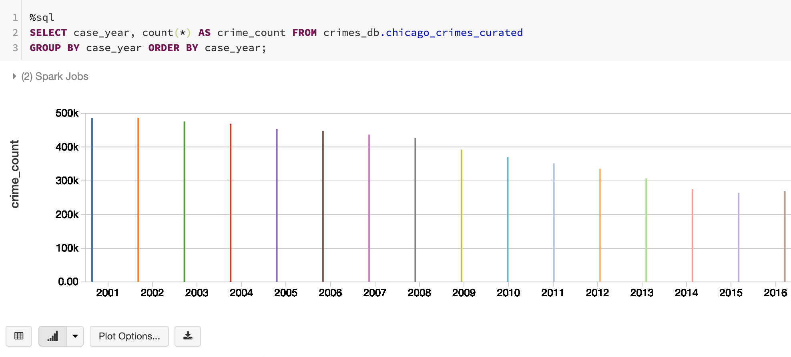
 

 

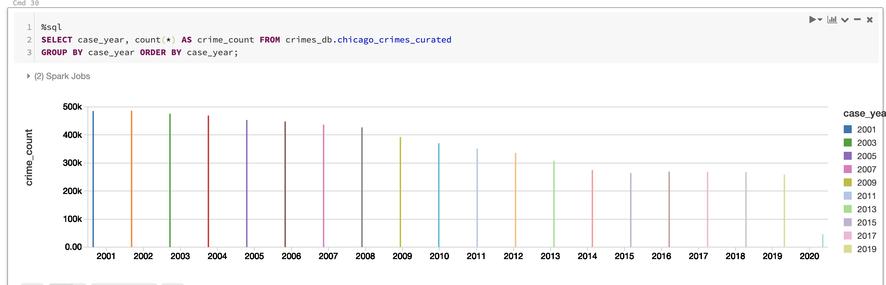
 

 

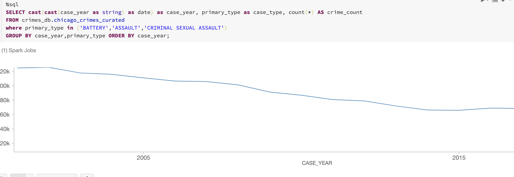
 

 

 
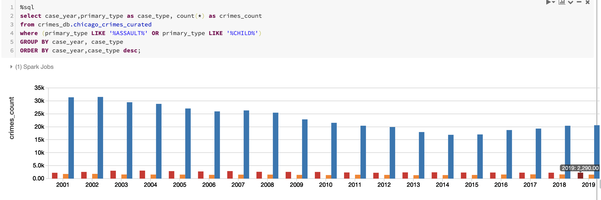
 

 

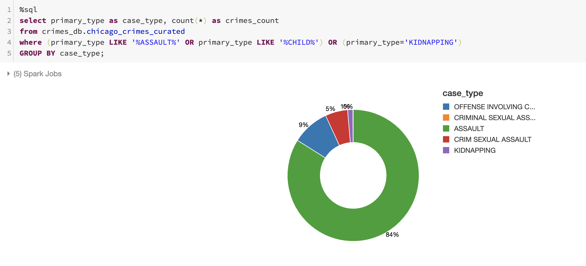
 

 

This concludes the module. 
[Return to the menu](https://github.com/anagha-microsoft/adx-kafkaConnect-hol/tree/master/hdi-standalone-nonesp#lets-get-started)
