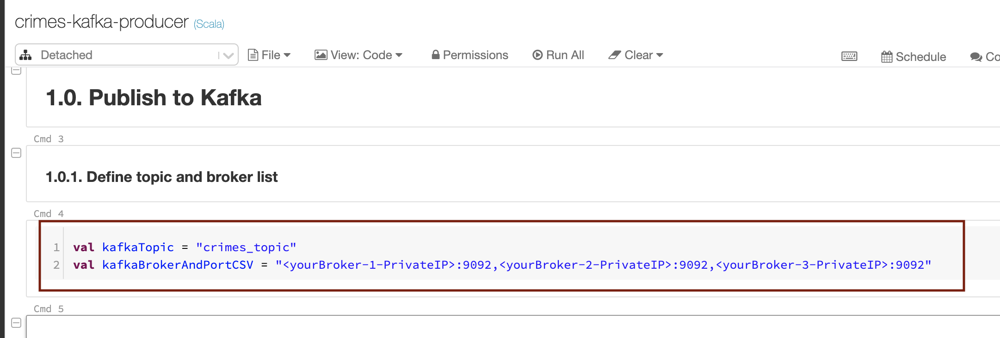
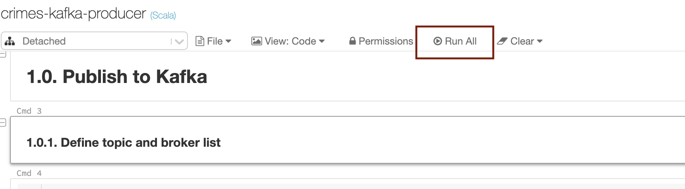
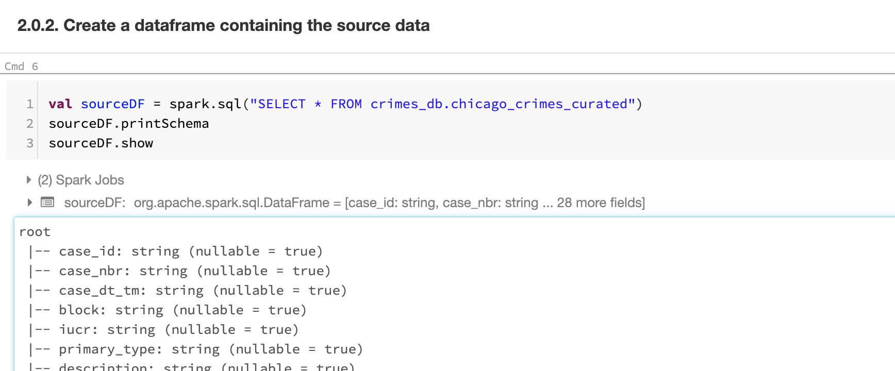
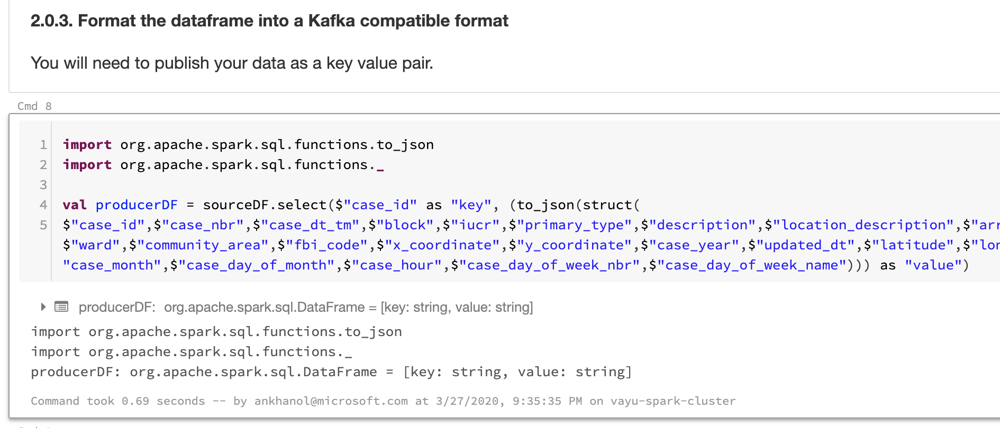
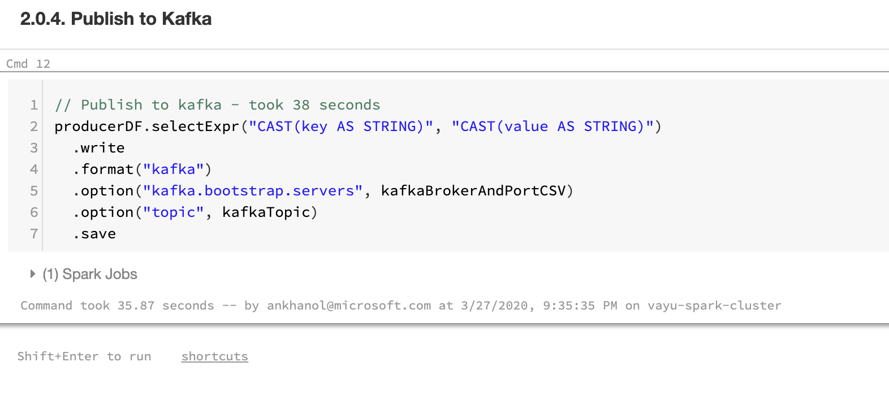

# About

This module covers publishing curated Chicago crimes to Kafka 

### 1. Update the topic name and broker list with your details

 

 

### 2. Run the notebook

 

 

### 3.  In 2.0.2, we are creating a dataframe containing the curated data

 

 

### 4.  In 2.0.3, we are formatting the data to a Kafka compatible format in another dataframe

 

 

### 5.  Here, we are just exploring the schema

 

 

### 6.  A quick count in Spark SQL

 

 

### 7.  Finally, publish the dataframe from #4, to Kafka

 

 

This concludes the module. 
[Return to the menu](https://github.com/anagha-microsoft/adx-kafkaConnect-hol/tree/master/hdi-standalone-nonesp#lets-get-started)
