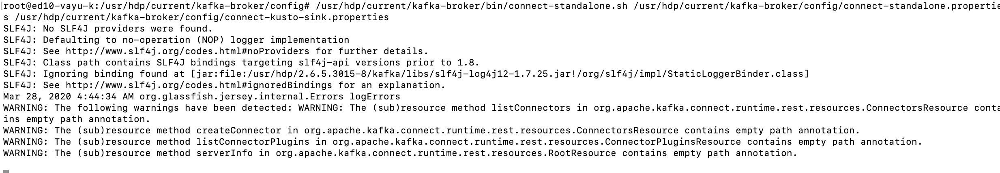
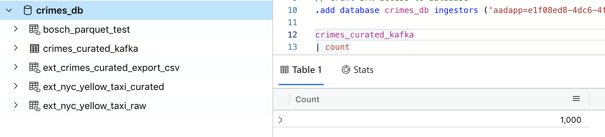
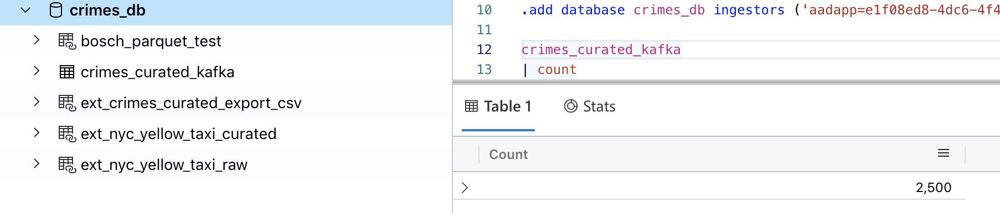
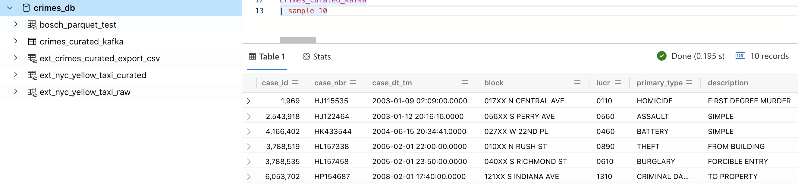

# About

This module covers validating the ingestion into Azure Data Explorer<br>

### 1. Double-check on the edge node to ensure that KafkaConnect service is running


<br>
<hr>
<br>


### 2. On the Azure Data Explorer Web UI, run a count, a few times and you should see the number increasing

```
crimes_curated_kafka
| count
```


<br>
<hr>
<br>


<br>
<hr>
<br>

### 3. On the Azure Data Explorer Web UI, run a sample, to ensure data is parsed correctly
```
crimes_curated_kafka
| sample 10
```


<br>
<hr>
<br>


This concludes the module.<br>
[Return to the menu](README.md)
