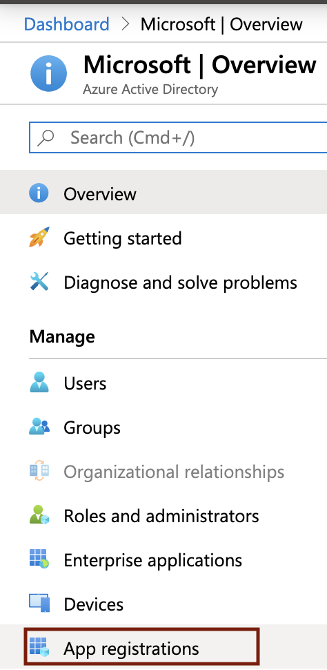
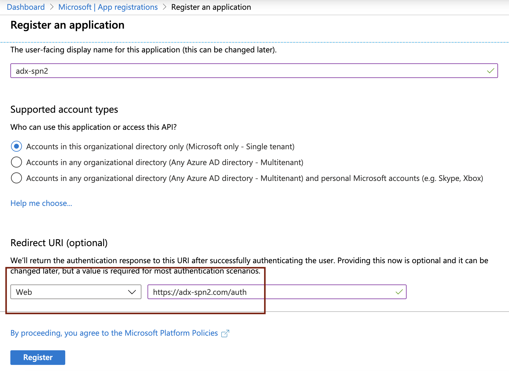
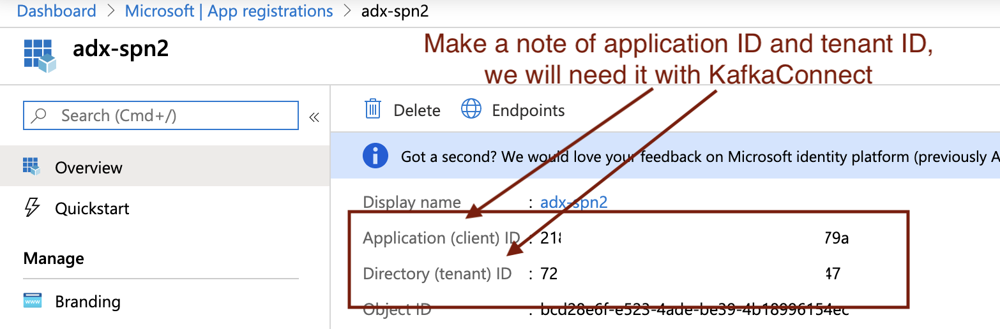
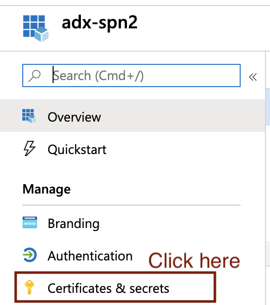
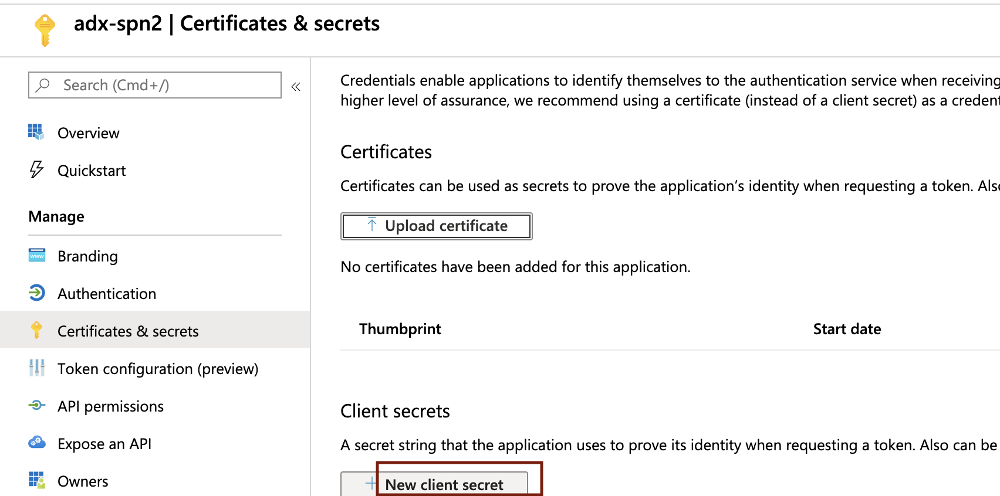
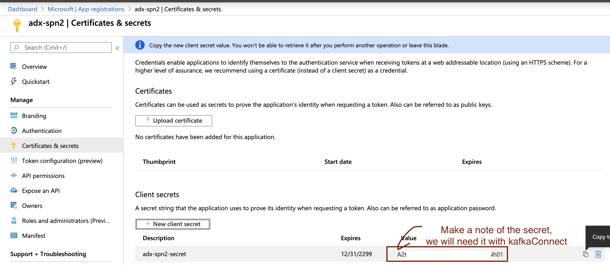

# About

This module covers provisioning an Azure Active Directory (AAD) Service Principal (SPN).  We will grant this SPN, the "ingestor" role in ADX, in the next module, and leverage the same to sink to ADX from Kafka in the KafkaConnect module. 

Navigate to portal.azure.com on your browser and follow the steps below: 

### 1. Click on Azure Active Directory

 

 

### 2. Click on App Registrations

 

 

### 3. Click on New Registration

 

 

### 4. Enter details as described

 

 

### 5. A service principal name/SPN gets created.  Make a note of the application/client ID and tenant ID; We will need this in the KafkaConnect module

 

 

### 6. Click on certificates and secrets; We will create a secret for the SPN

 

 

### 7. Click on new secret

 

 

### 8. Enter details and "add"

 

 

### 9. Make a note of the secret, it wont be available after.  We will need this in the KafkaConnect module

 

 

This concludes the module. 
[Return to the menu](README.md)
