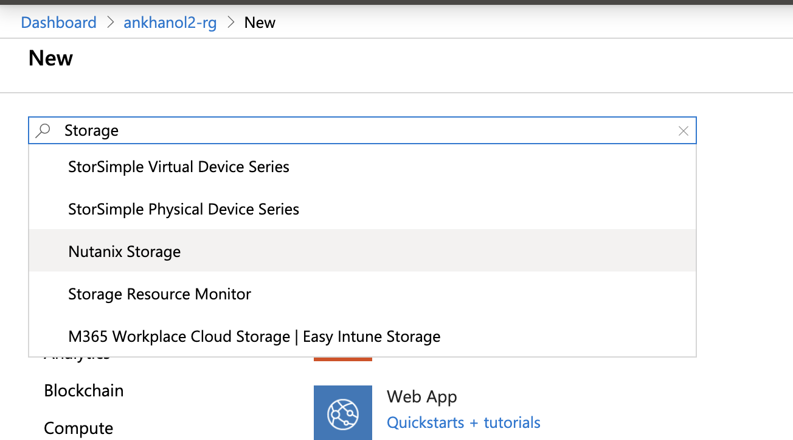
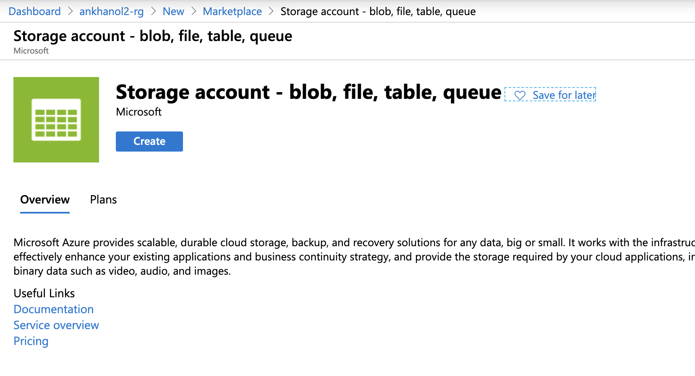
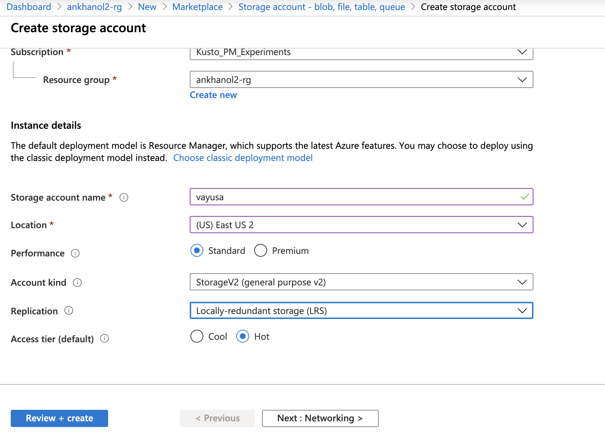
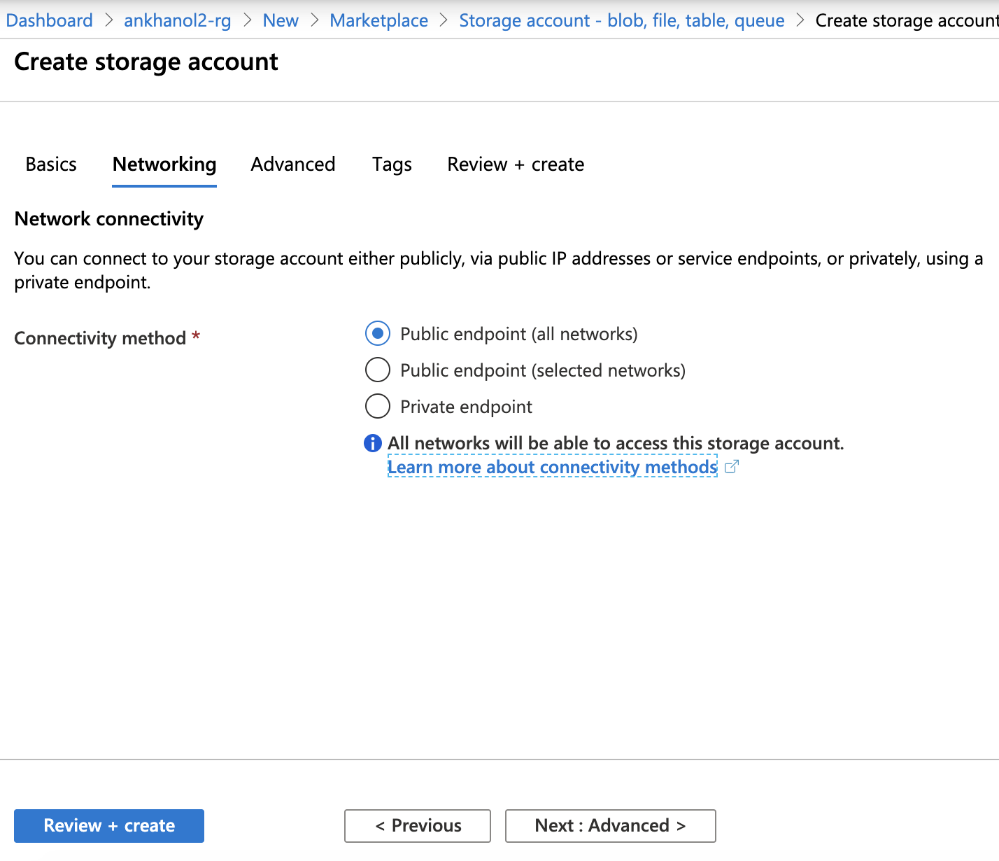
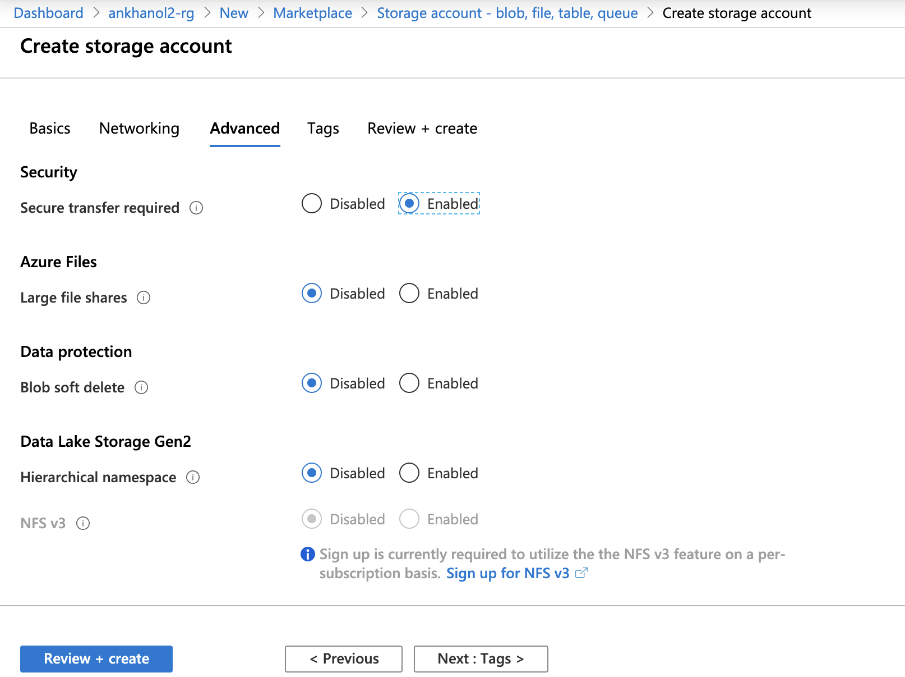
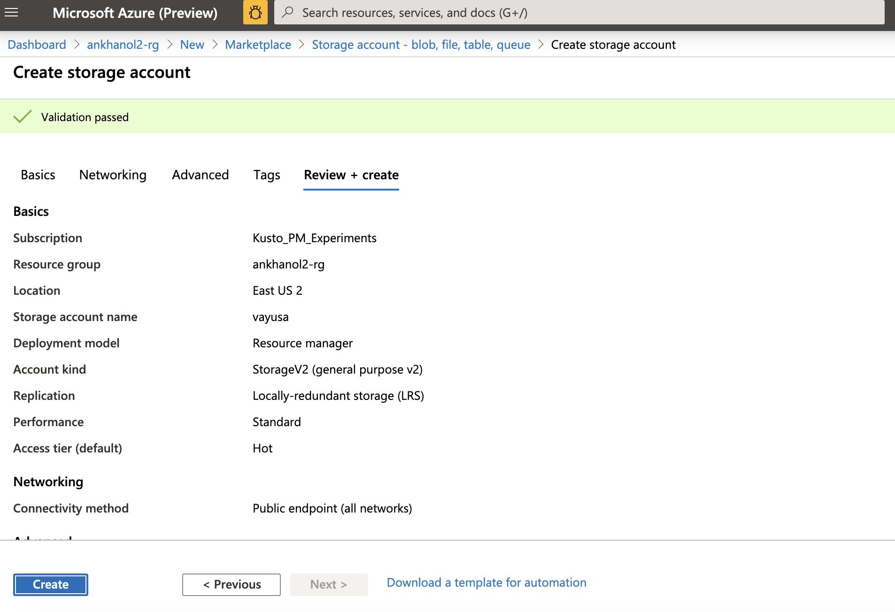
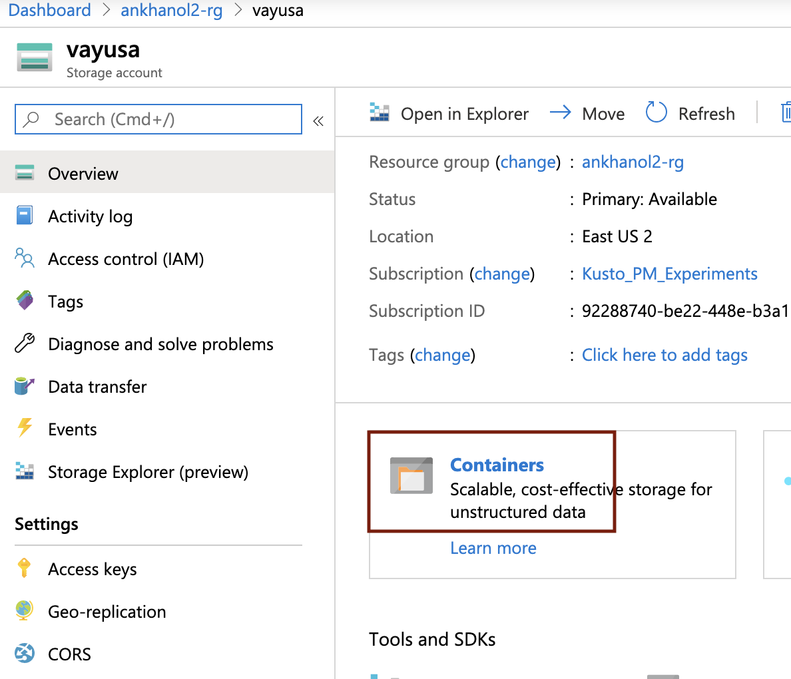
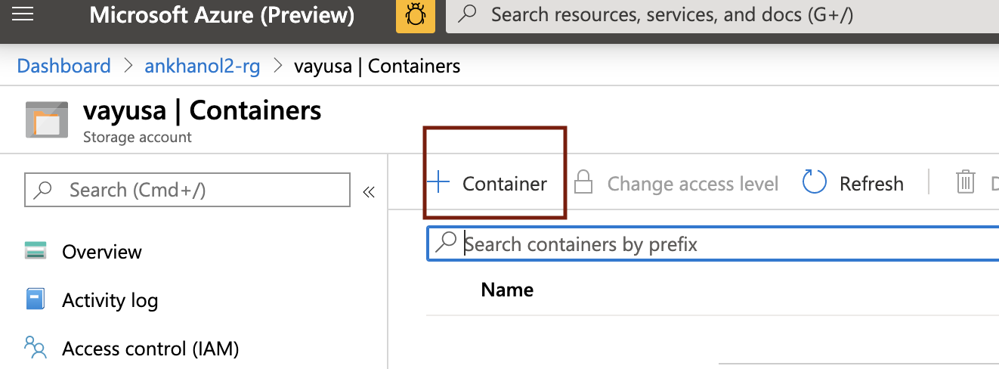
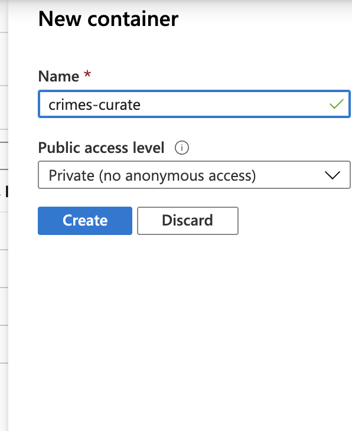

[Return to the HDI Kafka with standalone KafkaConnect menu](README.md) | [Kafka Integration Main Menu](../../README.md) 

# About

This module covers provisioning of a storage account v2 and containers needed for the lab. 
Navigate to your resource group, and click on "Add" and follow the steps below. 

### 1. Search for "Storage Account"

 

 

### 2. Click "create"

 

 

### 3. Enter details, be sure to select the right resource group and region

 

 

### 4. Select Locally Redundant Storage

 

 

### 5. In the advanced tab, leave defaults

 

 

### 6. Validate and click "create"

 

 

### 7. Once the service is provisioned, click on it in your resource group, we will create containers

 

 

### 8. Click on "Containers"

 

 

### 9. Click on "+Container"

 

 

### 10. Create a container called "crimes-curated"

 

 

### 11. Create additional containers as described below, without typos

 

 

This concludes the module. 

[Return to the HDI Kafka with standalone KafkaConnect menu](README.md) | [Kafka Integration Main Menu](../../README.md) 

