[Return to the HDI Kafka with standalone KafkaConnect menu](README.md) | [Kafka Integration Main Menu](../../README.md) <hr>

# About

This module covers provisioning a HDInsight cluster.  Navigate to your resource group, and click on "Add" and follow the steps below.<br>

### 1. Search for "Azure HDInsight"
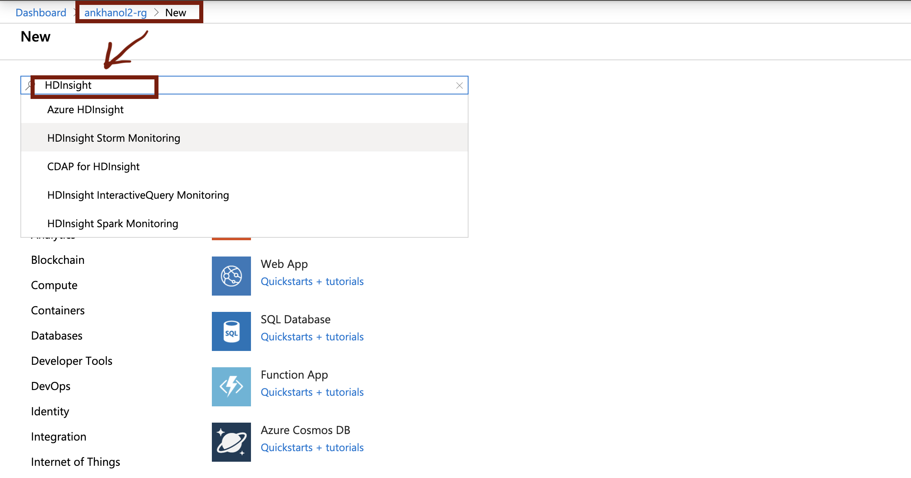
<br>
<hr>
<br>

### 2. Click create

<br>
<hr>
<br>

### 3. Enter details, click on cluster type, select Kafka
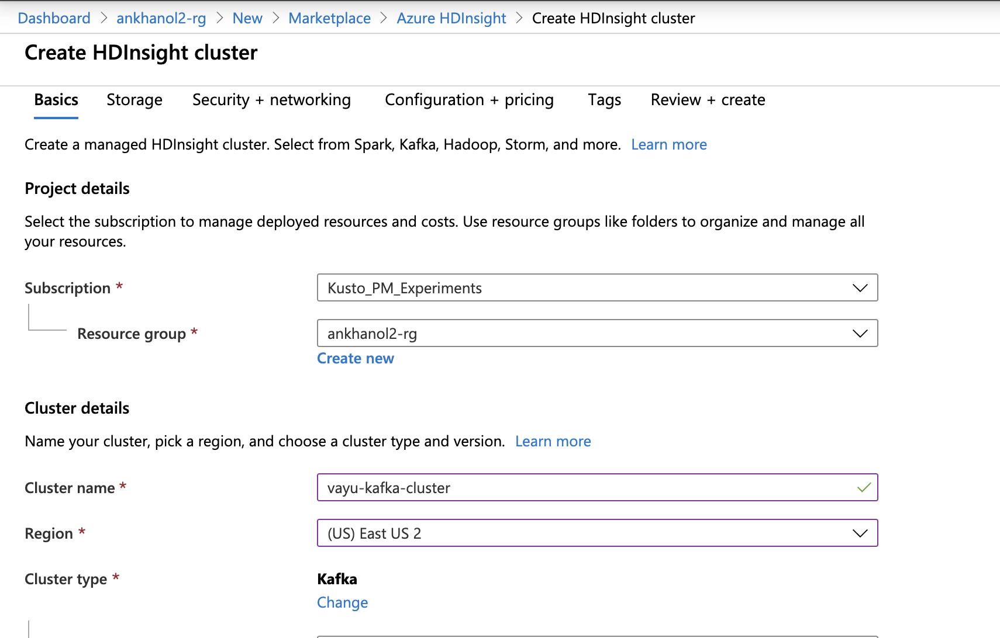
<br>
<hr>
<br>

### 4. Enter credentials

<br>
<hr>
<br>

### 5. Select "new" storage
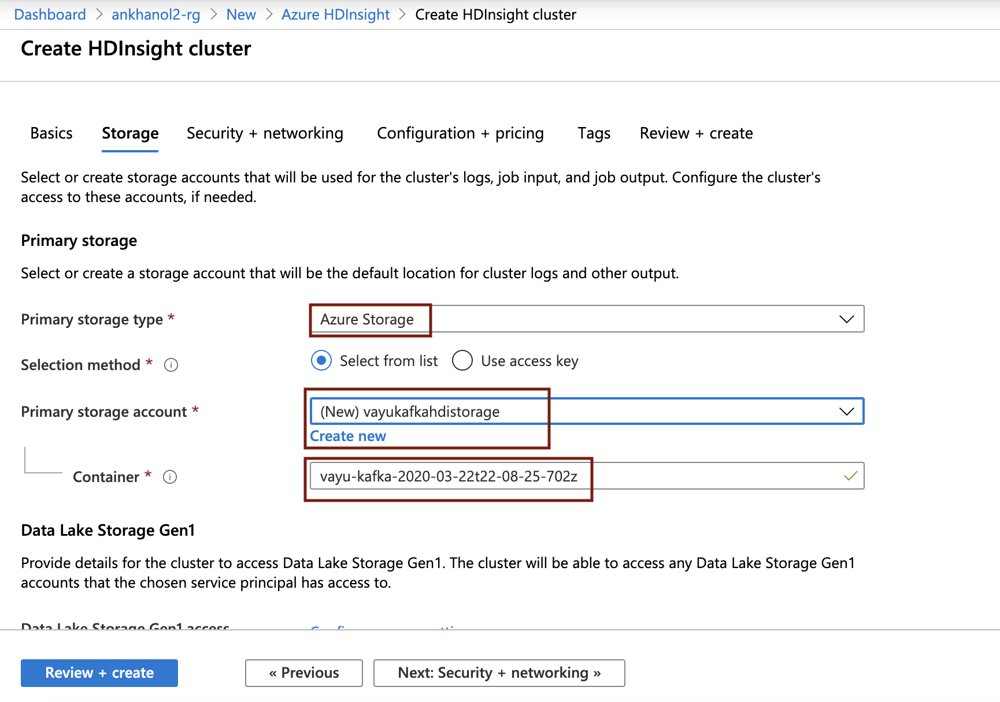
<br>
<hr>
<br>

### 6. Enter details as depicted

<br>
<hr>
<br>


### 7. Select TLS 1.2 in the networking tab 

<br>
<hr>
<br>

### 8. Select virtual network and kafka subnet 
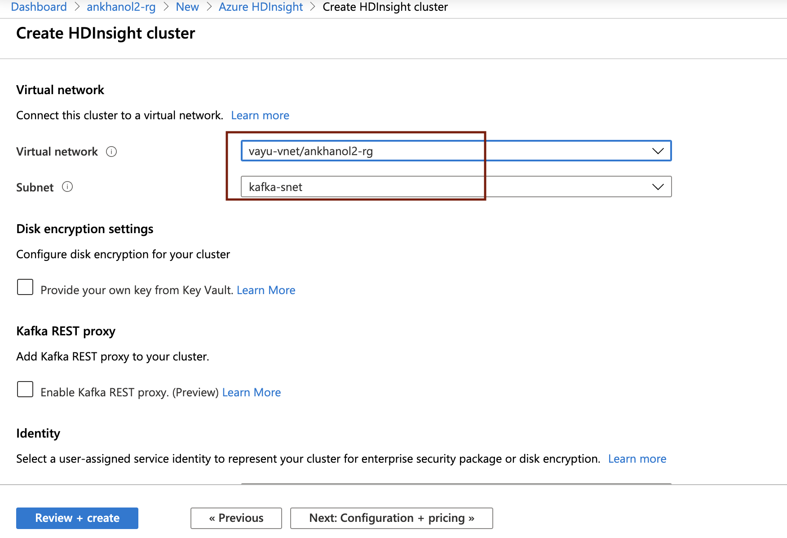
<br>
<hr>
<br>

### 9. Leave default, except have 3 broker/worker nodes
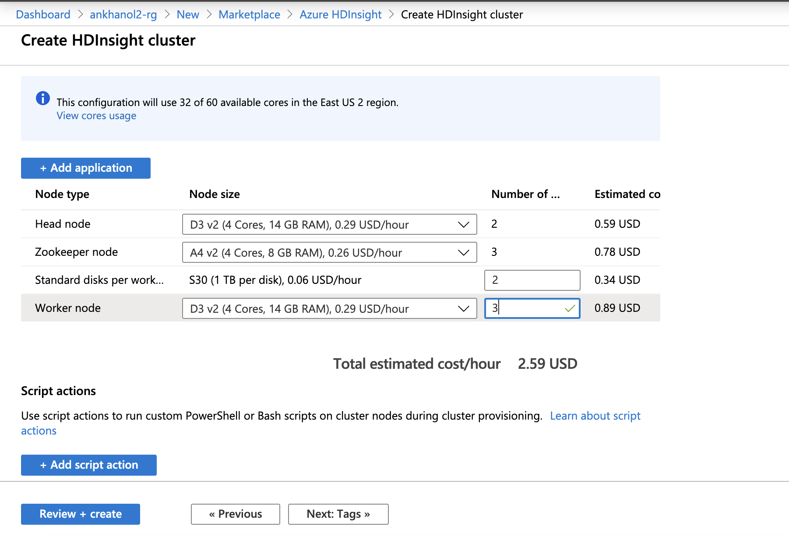
<br>
<hr>
<br>

### 10. Click create

<br>
<hr>
<br>

### 11. You should see this icon for HDInsight in your resource group, click on it 

<br>
<hr>
<br>

### 12. In this UI, click on cluster dashboards
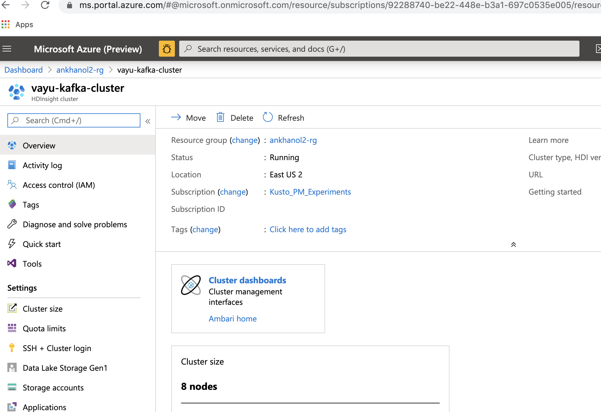
<br>
<hr>
<br>

### 13. Click on Ambari home; Ambari is the cluster manager

<br>
<hr>
<br>

### 14. Enter credentials

<br>
<hr>
<br>

### 15. You should see the cluster healthy

<br>
<hr>
<br>

### 16. Click on hosts
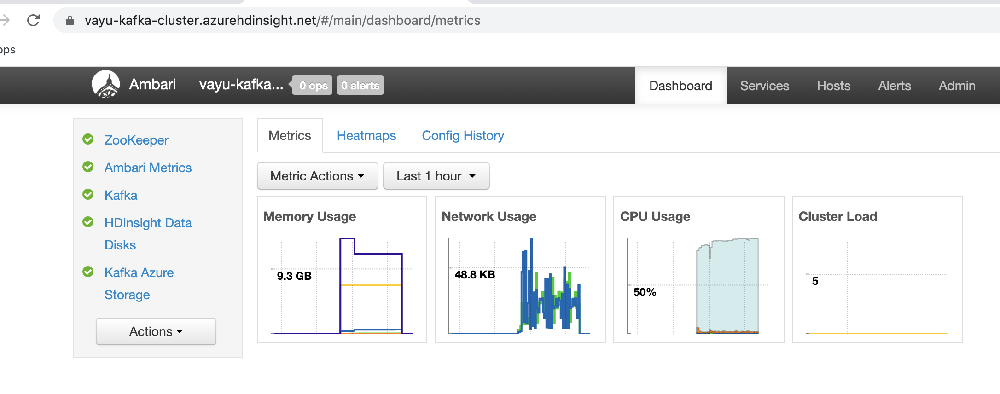
<br>
<hr>
<br>

### 17. Make a note of broker IPs with port number of 9092
E.g. for the below, its 10.15.1.12:9092,10.15.1.15:9092,10.15.1.18:9092


<br>
<hr>
<br>

### 18. Click on Kafka
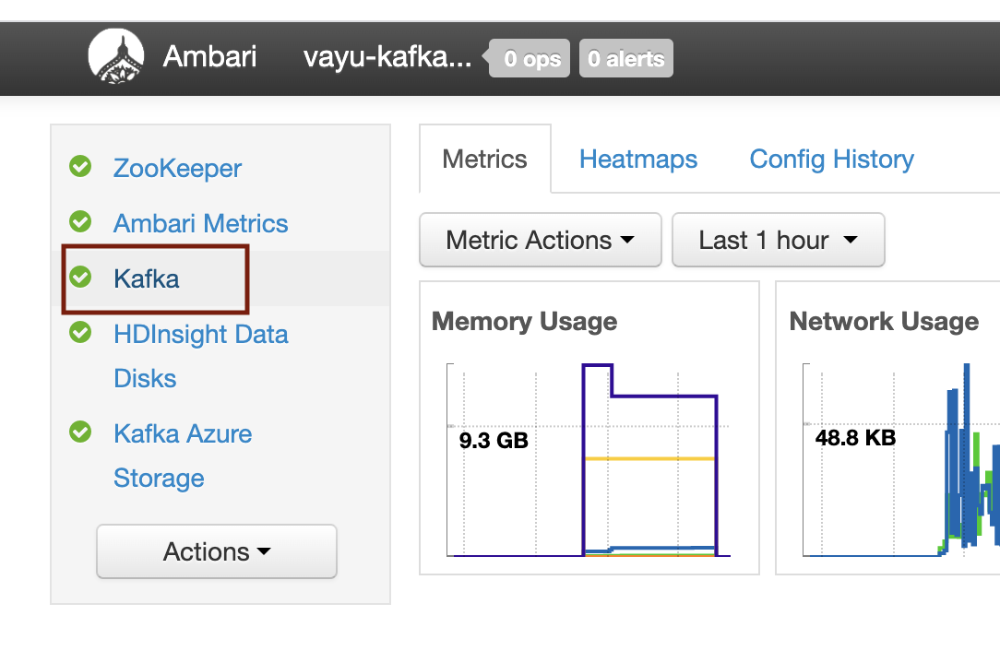
<br>
<hr>
<br>

### 19. Click on configs
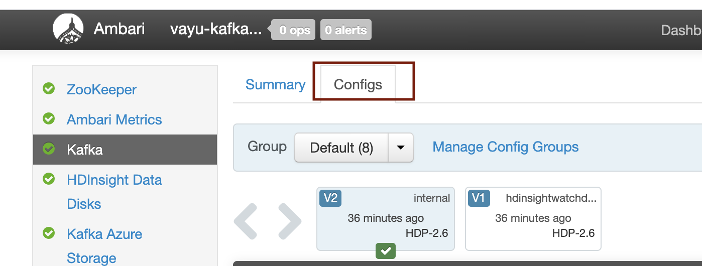
<br>
<hr>
<br>

### 20. In the search, type "Kafka-env"

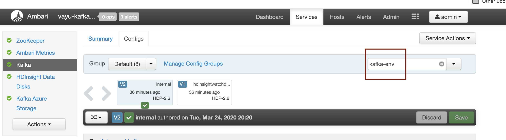
<br>
<hr>
<br>

### 21. Paste this after the very last line for kafka-env

```
# Configure Kafka to advertise IP addresses instead of FQDN
IP_ADDRESS=$(hostname -i)
echo advertised.listeners=$IP_ADDRESS
sed -i.bak -e '/advertised/{/advertised@/!d;}' /usr/hdp/current/kafka-broker/conf/server.properties
echo "advertised.listeners=PLAINTEXT://$IP_ADDRESS:9092" >> /usr/hdp/current/kafka-broker/conf/server.properties

```

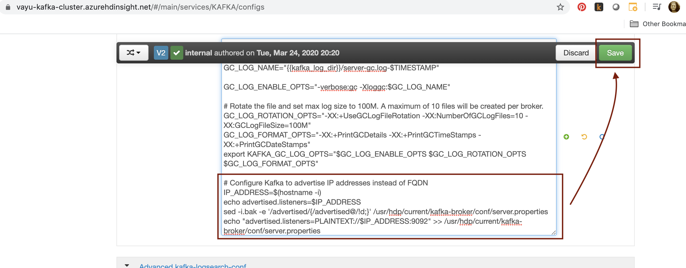
<br>
<hr>
<br>

### 22. Click on save

<br>
<hr>
<br>

### 23. Click on ok

<br>
<hr>
<br>

### 24. Lets go back to configs and search for "listener"

<br>
<hr>
<br>

### 25. Replace the value there with ```PLAINTEXT://0.0.0.0:9092.```

<br>
<hr>
<br>

### 26. Click on save

<br>
<hr>
<br>

### 27. Click on ok
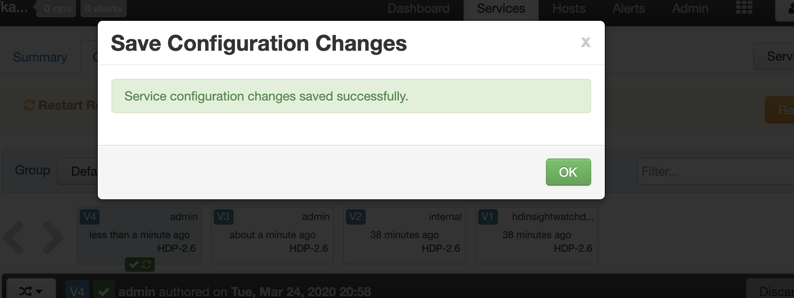
<br>
<hr>
<br>

### 28. Click on restart to restart cluster after the conf changes

<br>
<hr>
<br>

### 29. You should see the restart

<br>
<hr>
<br>

### 30. And the cluster looking healthy
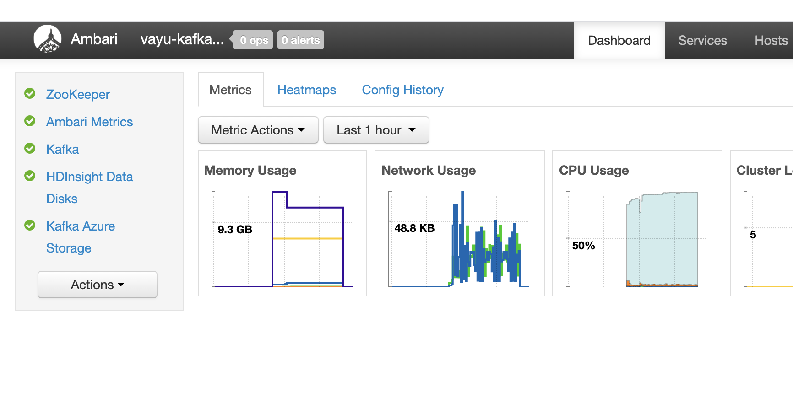
<br>
<hr>
<br>


This concludes the module.<br>

[Return to the HDI Kafka with standalone KafkaConnect menu](README.md) | [Kafka Integration Main Menu](../../README.md) <hr>
