# KAFKA INTEGRATION LABS
 

[Return to the HDI Kafka with standalone KafkaConnect menu](README.md) | [Kafka Integration Main Menu](../README.md) 

# About

This module covers provisioning an edge node on an existing HDInsight cluster.  
Navigate to ythe URL https://docs.microsoft.com/en-us/azure/hdinsight/hdinsight-apps-use-edge-node

### 1. Click on deploy
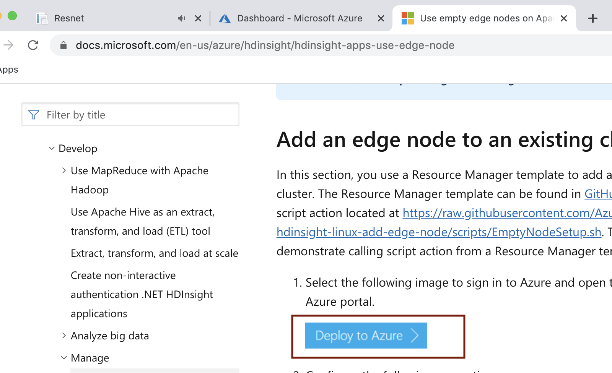
 

 

### 2. Enter details
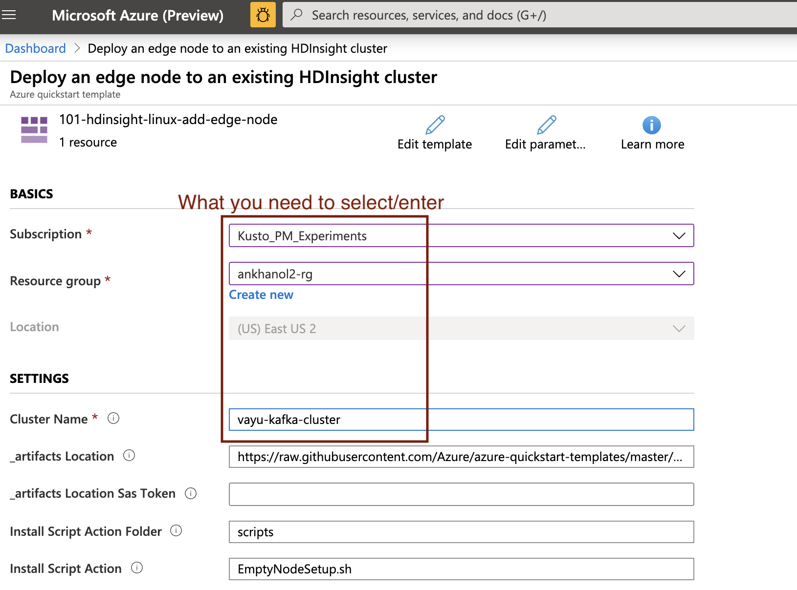
 

 

### 3. Agree to terms and click on purchase
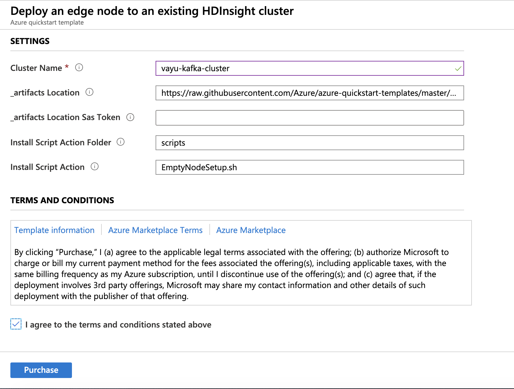
 

 

### 4. Monitor the provisioning to completion
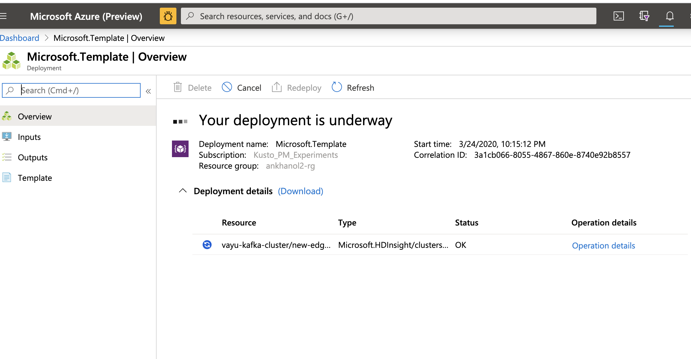
 

 

### 5. When it completes, it should look like this
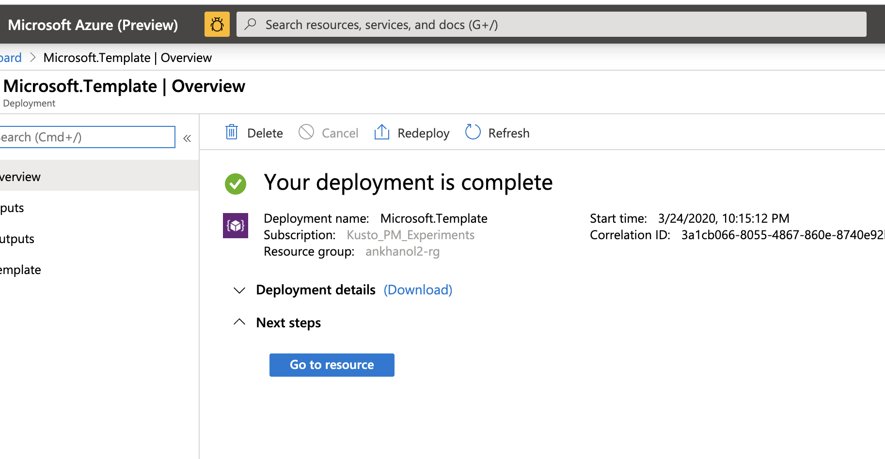
 

 

### 6. Switch back to Ambari, click on hosts
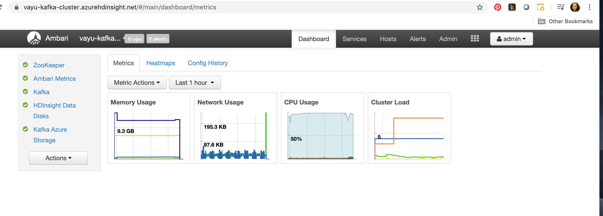
 

 

### 7. Make a note of the edge node private IP address.  The edge node name starts with "e"
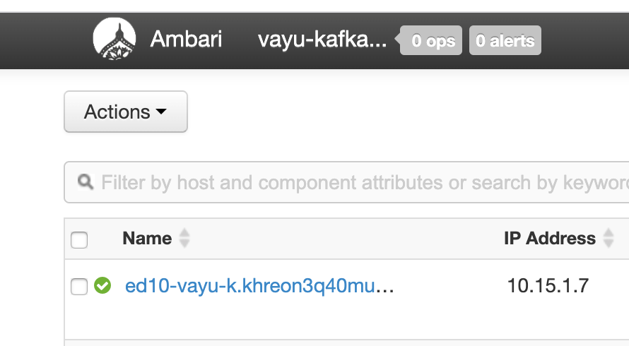
 

 

### 8. On the left navigation panel, click on SSH, not cluster size 
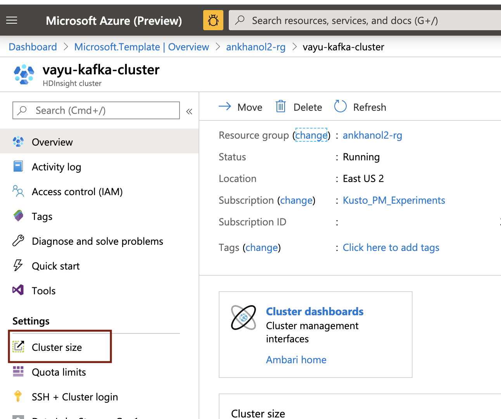
 

 

### 9. Copy the SSH command
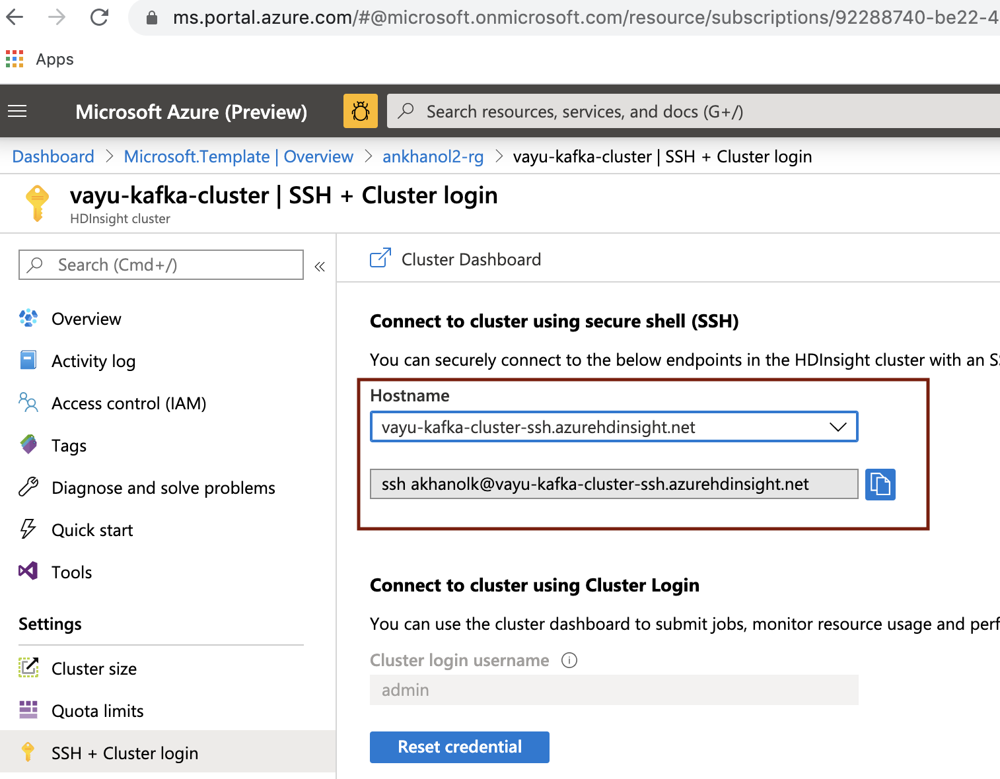
 

 

### 10. Using Putty or your Linux command line, or Azure cloud bash shell, SSH to the the cluster head node
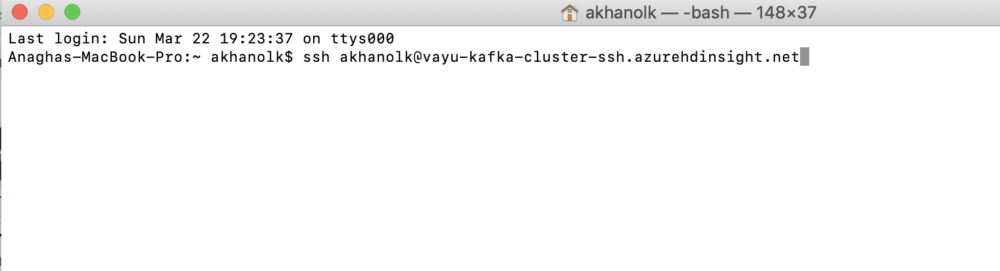
 

 

### 11. Enter your password
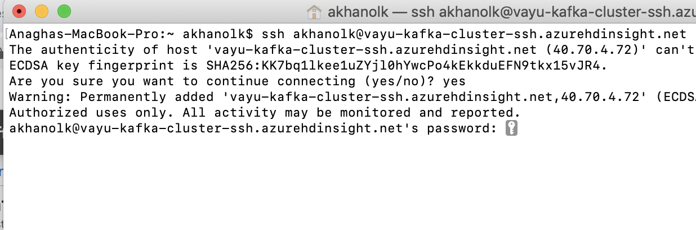
 

 

### 12. Once logged in, SSH to the edge node with the IP you captured in the step 7; Use same password as SSH to head node 
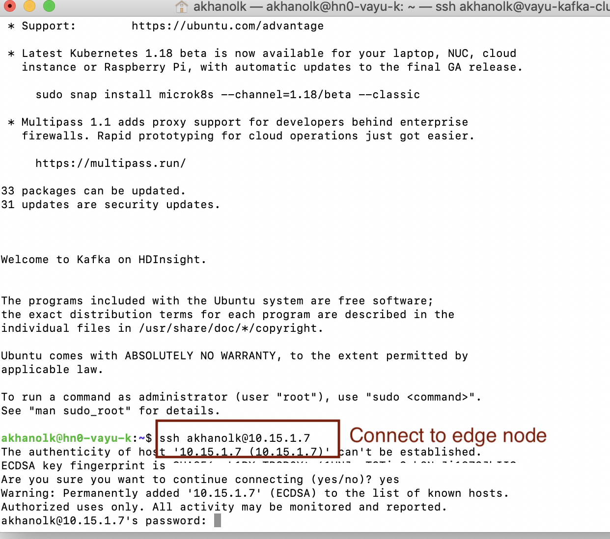
 

 

### 13. All is well if you are able to login
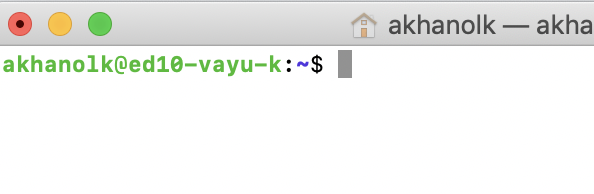
 

 

This concludes the module. 

[Return to the HDI Kafka with standalone KafkaConnect menu](README.md) | [Kafka Integration Main Menu](../README.md) 

