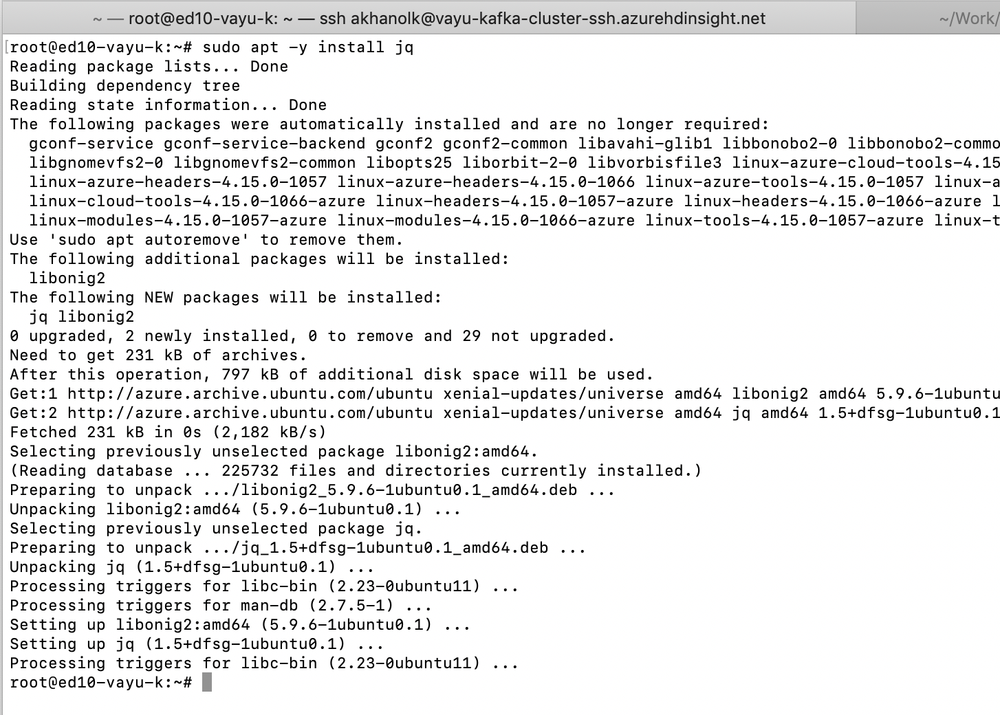

# KAFKA INTEGRATION LABS
<br>

[Return to the HDI Kafka with standalone KafkaConnect menu](README.md) | [Kafka Integration Main Menu](../README.md) <hr>

# About

This module covers creating a Kafka topic that we will publish events to.  
Switch to your SSH terminal, where you logged into the edge node.


### 1. SSH to the edge node ands switch to root


<br>
<hr>
<br>


<br>
<hr>
<br>


### 2. Install jq to process json easily

```
sudo su -
apt -y install jq
```


<br>
<hr>
<br>

### 3. Create a variable and populate it with the cluster name
```
read -p "Enter the Kafka on HDInsight cluster name: " CLUSTERNAME
```
Enter the cluster name at the prompt, and then echo the variable to ensure it has the right value.


<br>
<hr>
<br>

### 4. Capture the zookeeper server FQDN:port CSV list into a variable, we need this for creating a Kafka topic 

```
export KAFKAZKHOSTS=`curl -sS -u admin -G https://$CLUSTERNAME.azurehdinsight.net/api/v1/clusters/$CLUSTERNAME/services/ZOOKEEPER/components/ZOOKEEPER_SERVER | jq -r '["\(.host_components[].HostRoles.host_name):2181"] | join(",")' | cut -d',' -f1,2`
```

Validate it:

```
echo $KAFKAZKHOSTS
```


<br>
<hr>
<br>

### 5. Create a Kafka topic called crimes_topic
```
/usr/hdp/current/kafka-broker/bin/kafka-topics.sh --create --replication-factor 3 --partitions 6 --topic crimes-topic --zookeeper $KAFKAZKHOSTS 
```


<br>
<hr>
<br>

### 6. List the topics to ensure it was created
```
/usr/hdp/current/kafka-broker/bin/kafka-topics.sh --list --zookeeper $KAFKAZKHOSTS 
```


<br>
<hr>
<br>

### 7. Set a retention on the topic to expire in 10 minutes
```
/usr/hdp/current/kafka-broker/bin/kafka-configs.sh --zookeeper $KAFKAZKHOSTS --alter --entity-type topics --entity-name crimes-topic --add-config retention.ms=600000
```

### 8. Should you ever need to delete a topic - informational
```
/usr/hdp/current/kafka-broker/bin/kafka-topics.sh --delete --topic crimes-topic --zookeeper $KAFKAZKHOSTS
```

### 9. List consumer groups - informational
```
/usr/hdp/current/kafka-broker/bin/kafka-consumer-groups.sh  --list --bootstrap-server 10.15.1.4:9092,10.15.1.8:9092,10.15.1.5:9092

/usr/hdp/current/kafka-broker/bin/kafka-consumer-groups.sh --describe --group connect-KustoSinkConnectorCrimes --bootstrap-server 10.15.1.4:9092,10.15.1.8:9092,10.15.1.5:9092

```

Here "connect-KustoSinkConnector" is the consumer group created by the Kafka connector.  This will be useful when you move to the module where you provision the connectors.

### 10. Describe a topic - informational

```
/usr/hdp/current/kafka-broker/bin/kafka-topics.sh --zookeeper $KAFKAZKHOSTS --describe --topic crimes-topic
```

<br>
This concludes the module.<br>

[Return to the HDI Kafka with standalone KafkaConnect menu](README.md) | [Kafka Integration Main Menu](../README.md) <hr>
