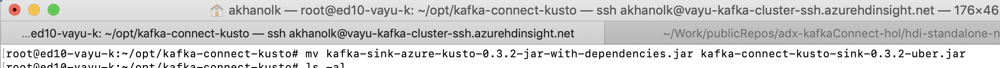

# KAFKA INTEGRATION LABS
<br>

[Return to the HDI Kafka with standalone KafkaConnect menu](README.md) | [Kafka Integration Main Menu](../README.md) <hr>

# About

This module covers downloading and configuring KafkaConnect for ADX and launching the service 
<br>

We will be setting some configuration for our KafkaConnect sink to Kusto<br>
Here are some notes about it, it is helpful to understand these as some of them are knobs for performance tuning<br>
This labe does not cover performance tuning<br>


**name**<br>
Unique name for the connector. Attempting to register again with the same name will fail<br>

**connector.class**<br>
The Java class for the connector

**tasks.max**<br>
The maximum number of tasks that should be created for this connector. The connector may create fewer tasks if it cannot achieve this level of parallelism<br>

**bootstrap.servers**<br>
A list of host/port pairs to use for establishing the initial connection to the Kafka cluster<br>

**key.converter**<br>
Converter class for key Connect data. This controls the format of the data that will be written to Kafka for source connectors or read from Kafka for sink connectors<br>

**value.converter**<br>
Converter class for value Connect data. This controls the format of the data that will be written to Kafka for source connectors or read from Kafka for sink connectors<br>

**flush.size**<br>
Number of records written to store before invoking file commits<br>

**flush.interval.ms**<br>
Interval at which to try committing offsets for tasks<br><br>

**Reference**: [Azure docs for the KafkaConnect ADX sink](https://docs.microsoft.com/en-us/azure/data-explorer/ingest-data-kafka)

### 1. SSH to the edge node ands switch to root


<br>
<hr>
<br>


<br>
<hr>
<br>

### 2. Install tree

```
apt-get install -y tree
```


<br>
<hr>
<br>

### 3. Create directory path for KafkaConnect jar download

```
 mkdir -p opt/kafka-connect-kusto
```

```
 tree opt
```


<br>
<hr>
<br>

### 4. Change to the directory created and download the jar

```
cd opt/kafka-connect-kusto
```

```
wget "https://github.com/Azure/kafka-sink-azure-kusto/releases/download/v0.3.2/kafka-sink-azure-kusto-0.3.2-jar-with-dependencies.jar"
```


<br>
<hr>
<br>

### 5. Rename the jar to have the prefix of 'kafka-connect'.  This is important because the default scripts that execute KafkaConnect search for jars starting with this name.

```
ls -al
```

```
mv kafka-sink-azure-kusto-0.3.2-jar-with-dependencies.jar kafka-connect-kusto-sink-0.3.2-uber.jar
```


<br>
<hr>
<br>


<br>
<hr>
<br>

### 6. Make the jar executable

```
chmod +x kafka-connect-kusto-sink-0.3.2-uber.jar 
```


<br>
<hr>
<br>

### 7. Copy the jar to the two directory paths (till we can reconcile to one path)

1.  Copy to /usr/hdp/current/kafka-broker/libs/

```
cp kafka-connect-kusto-sink-0.3.2-uber.jar /usr/hdp/current/kafka-broker/libs/
```


<br>
<hr>
<br>

```
ls -al /usr/hdp/current/kafka-broker/libs/ | grep kusto
```


<br>
<hr>
<br>

2.   Copy to /usr/share/java/

```
cp kafka-connect-kusto-sink-0.3.2-uber.jar /usr/share/java/
```

```
ls -al /usr/share/java/ | grep kusto
```


<br>
<hr>
<br>

### 8. Navigate to the Kafka broker config directory


```
cd /usr/hdp/current/kafka-broker/config/
```


<br>
<hr>
<br>

Of importance is - 
The connect-standalone.properties file, we will edit this.

### 9. Edit the connect-standalone.properties

1.  You will need your broker list from [this step](https://github.com/anagha-microsoft/adx-kafkaConnect-hol/blob/master/hdi-standalone-nonesp/Module-06.md#17-make-a-note-of-broker-ips-with-port-number-of-9092)
<br>
2.  We will edit the properties file as follows:
- Update the broker list with your brokerPrivateIP:port list
- Update the key.converter and value.converter
- Uncomment and update the plugin path to /usr/hdp/current/kafka-broker/libs/,/usr/share/java

```
vi /usr/hdp/current/kafka-broker/config/connect-standalone.properties
```


<br>
<hr>
<br>


<br>
<hr>
<br>


<br>
<hr>
<br>

Modify the above to the below<br>

```
key.converter=org.apache.kafka.connect.storage.StringConverter
value.converter=org.apache.kafka.connect.storage.StringConverter
```


<br>
<hr>
<br>


<br>
<hr>
<br>

Modify the above to the below<br>

```
plugin.path=/usr/hdp/current/kafka-broker/libs/,/usr/share/java
```


<br>
<hr>
<br>

### 10. Create the connect-kusto-sink.properties file with your Kafka topic, KafkaConnect conf, ADX conf

a) Revisit the portal, your ADX cluster instance for the ingestion URI


<br>
<hr>
<br>

b) Revisit the details of your service principal from [here](https://github.com/anagha-microsoft/adx-kafkaConnect-hol/blob/master/hdi-standalone-nonesp/Module-04.md#5-a-service-principal-namespn-gets-created--make-a-note-of-the-applicationclient-id-and-tenant-id-we-will-need-this-in-the-kafkaconnect-module) and [here](https://github.com/anagha-microsoft/adx-kafkaConnect-hol/blob/master/hdi-standalone-nonesp/Module-04.md#9-make-a-note-of-the-secret-it-wont-be-available-after--we-will-need-this-in-the-kafkaconnect-module)

We will need-
- Tenant ID
- SPN Application ID
- SPN Secret Access Key

Once you have the details - start the editing...

```
vi /usr/hdp/current/kafka-broker/config/connect-kusto-sink.properties
```

Paste the following and replace with your details.

```
name=KustoSinkConnector 
connector.class=com.microsoft.azure.kusto.kafka.connect.sink.KustoSinkConnector
kusto.sink.flush_interval_ms=300000
tasks.max=2
topics=crimes_topic
kusto.tables.topics_mapping=[{'topic': 'crimes_topic','db': 'crimes_db', 'table': 'crimes_curated_kafka','format': 'json', 'mapping':'crimes_curated_kafka_mapping'}]
kusto.auth.authority=<yourAADTenantID>
kusto.url=<yourADXClusterIngestURI>
kusto.auth.appid=<yourAADSPNApplicationID>
kusto.auth.appkey=<yourAADSPNSecret>
kusto.sink.tempdir=/var/tmp/
kusto.sink.flush_size=1000
value.converter=org.apache.kafka.connect.storage.StringConverter
key.converter=org.apache.kafka.connect.storage.StringConverter
```

**Knobs for performance tuning are:**
- kusto.sink.flush_interval_ms
- tasks.max
- kusto.sink.flush_size
- Proper sizing of your ADX cluster
- And you need to set the streaming ingestion policy on (we did this already)

Here is a sample:

<br>
<hr>
<br>

### 11. Start the KafkaConnect service

```
/usr/hdp/current/kafka-broker/bin/connect-standalone.sh /usr/hdp/current/kafka-broker/config/connect-standalone.properties /usr/hdp/current/kafka-broker/config/connect-kusto-sink.properties
```

Leave this service running and move to the next module.


This concludes the module.<br>

[Return to the HDI Kafka with standalone KafkaConnect menu](README.md) | [Kafka Integration Main Menu](../README.md) <hr>
