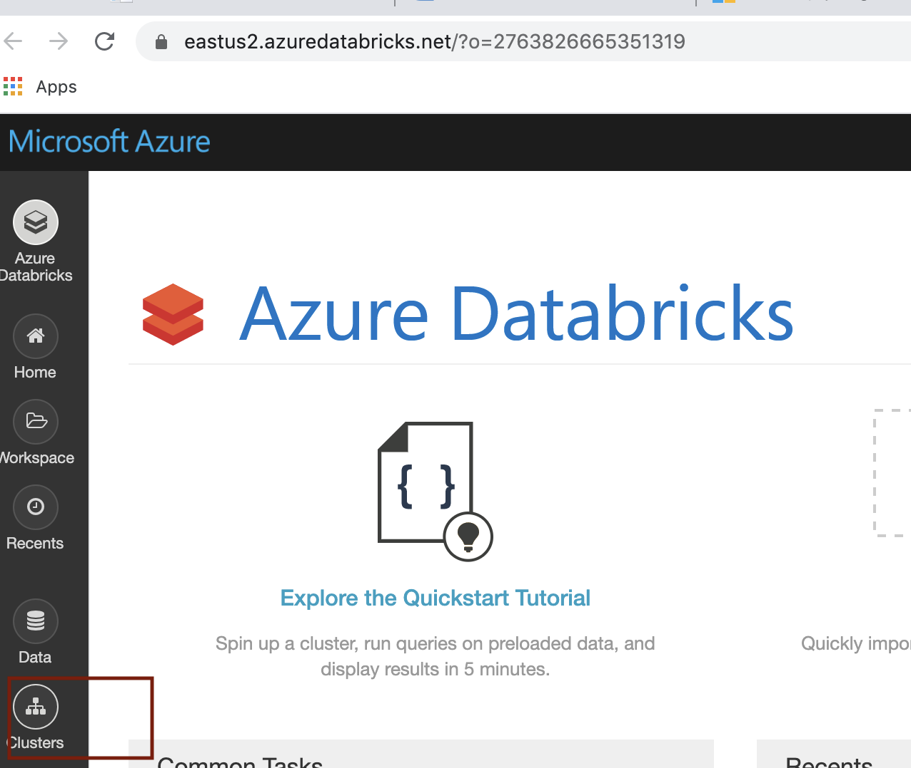
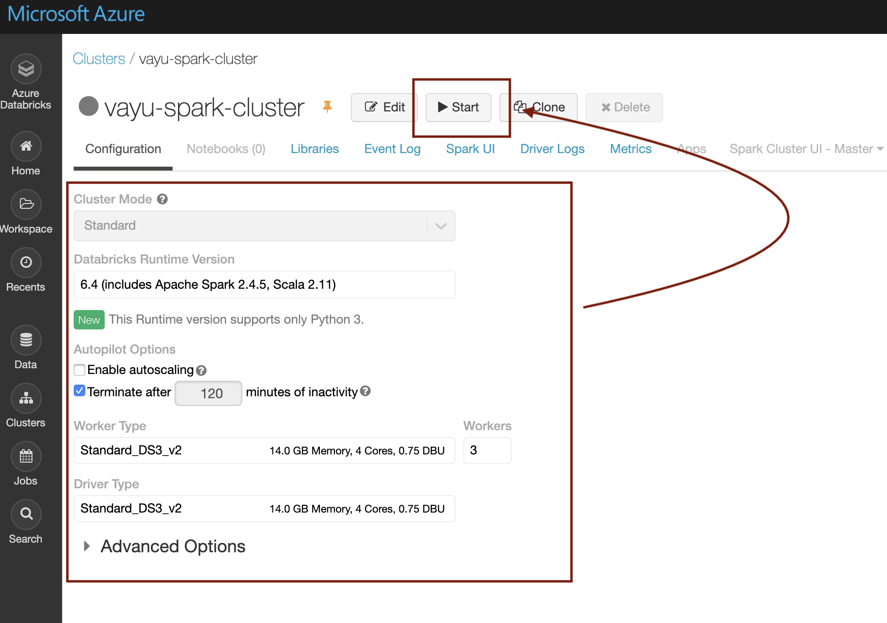

# KAFKA INTEGRATION LABS
 

[Return to the HDI Kafka with standalone KafkaConnect menu](README.md) | [Kafka Integration Main Menu](../README.md) 

# About

This module covers creating a Databricks cluster and pinning it.  We will use Spark Structured Streaming to stream data to Kafka in a subsequent module. 

Navigate to your Databricks workspace.

### 1. Click on clusters

 

 

### 2. Click on create clusters

 

 

### 3. Enter a name, pick the number of nodes, click on start 

 

 

### 4. Pin the cluster, so its metadata is persisted indefinitely; Otherwise if you dont use your workspace, and dont fire up your cluster for a few weeks, the cluster definition is deleted permanently.

 

 

This concludes the module. 

[Return to the HDI Kafka with standalone KafkaConnect menu](README.md) | [Kafka Integration Main Menu](../README.md) 

