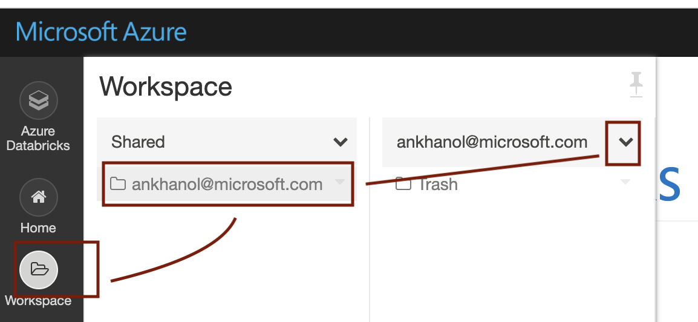
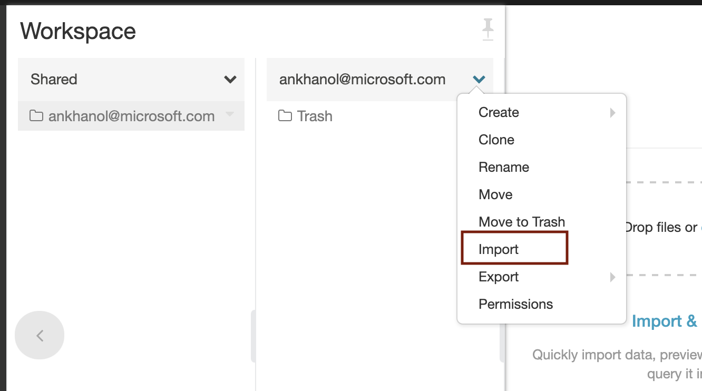
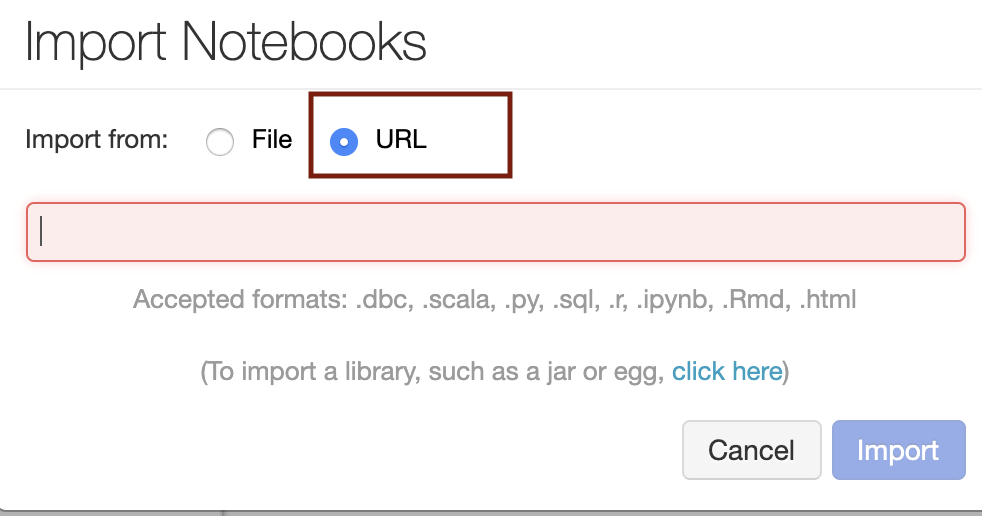
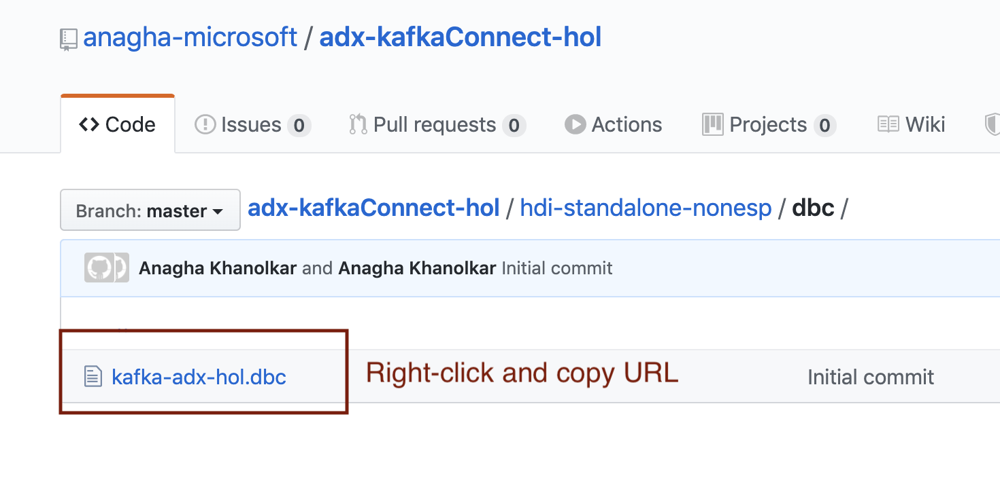
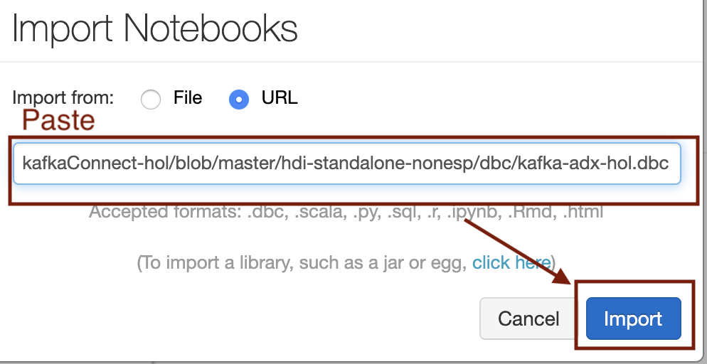
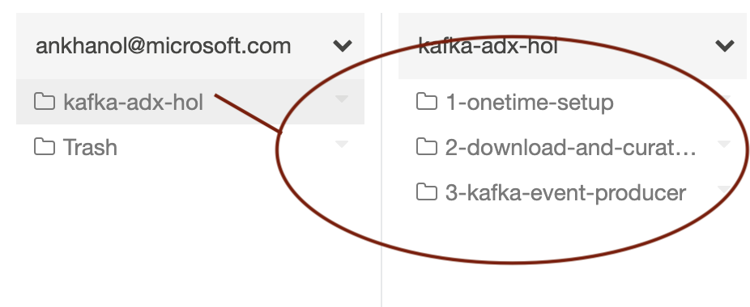
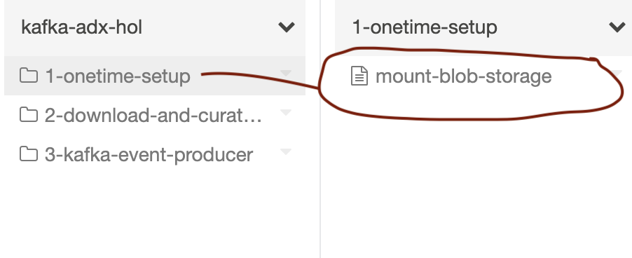
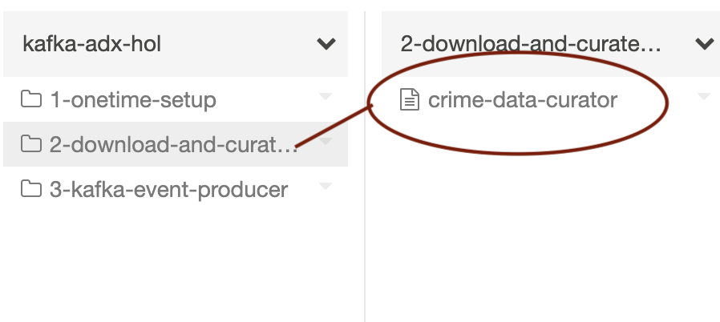
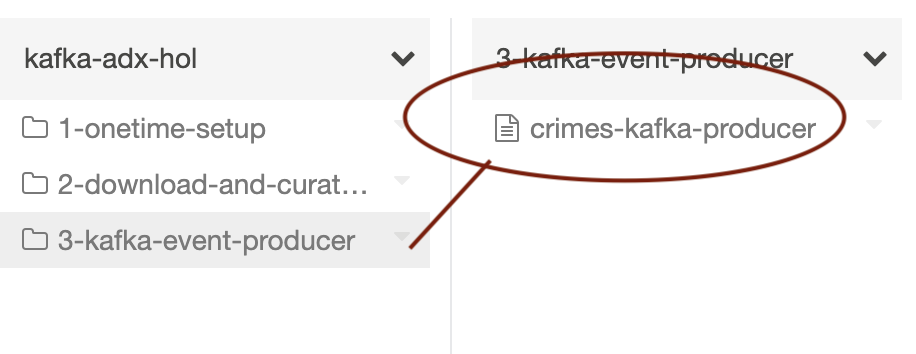

[Return to the HDI Kafka with standalone KafkaConnect menu](README.md) | [Kafka Integration Main Menu](../README.md) 

# About

This module covers importing the Spark source code from git, and a quick review of the notebooks. 

### 1. Click on workspace and then on shared, then your name, and finally the down arrow

 

 

### 2. Click on import

 

 

### 3.Click on URL

 

 

### 4. Get the link to the Databricks code archive for the lab, and copy the link to clipboard

Location: 
https://github.com/anagha-microsoft/adx-kafkaConnect-hol/tree/master/hdi-standalone-nonesp/dbc 

Name: 
kafka-adx-hol.dbc

 

 

### 5. Paste the URL and click on import

 

 

### 6. Three directories

 

 

### 7. The first one covers mounting blob storage

 

 

### 8. The second one downloads Chicago crimes dataset and curates it, does some cursory visualization

 

 

### 9. The third one streams the curated crimes to Kafka

 

 

This concludes the module. 

[Return to the HDI Kafka with standalone KafkaConnect menu](README.md) | [Kafka Integration Main Menu](../README.md) 

