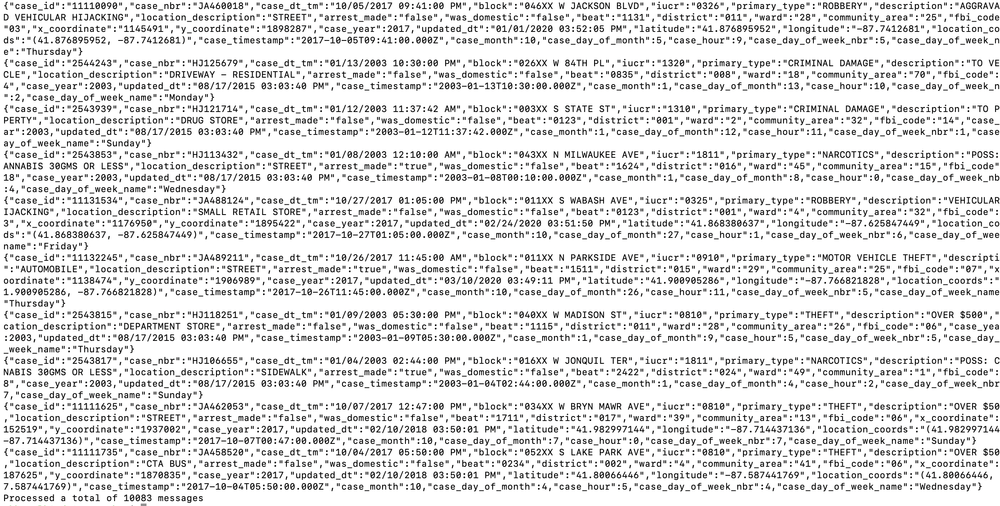

[Return to the HDI Kafka with standalone KafkaConnect menu](README.md) | [Kafka Integration Main Menu](../../README.md) <hr>

# About

This module covers validating that the Kafka topic indeed has events published to it from the previous module.  Switch to your Kafka edge node, we will run the Kafka console consumer to validate.<br>


### 1. Run the Kafka console consumer against the topic and stop right away
Be sure to update the broker list with your brokers' IP addresses

```
/usr/hdp/current/kafka-broker/bin/kafka-console-consumer.sh --bootstrap-server 10.15.1.18:9092,10.15.1.15:9092,10.15.1.12:9092 --topic "crimes_topic" --from-beginning
```


<br>
<hr>
<br>

### 2. You should see some events on the screen


<br>
<hr>
<br>


This concludes the module.<br>

[Return to the HDI Kafka with standalone KafkaConnect menu](README.md) | [Kafka Integration Main Menu](../../README.md) <hr>
